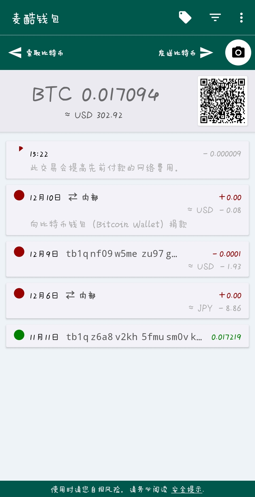
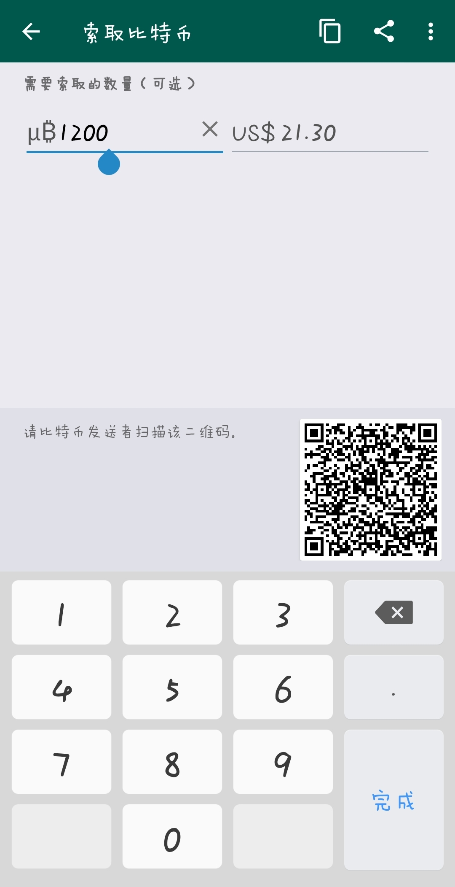
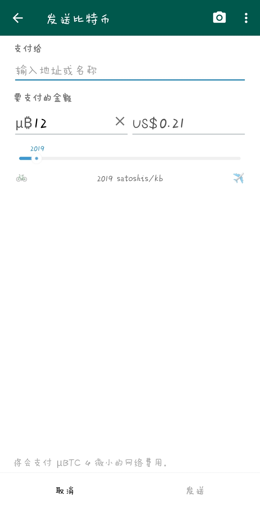
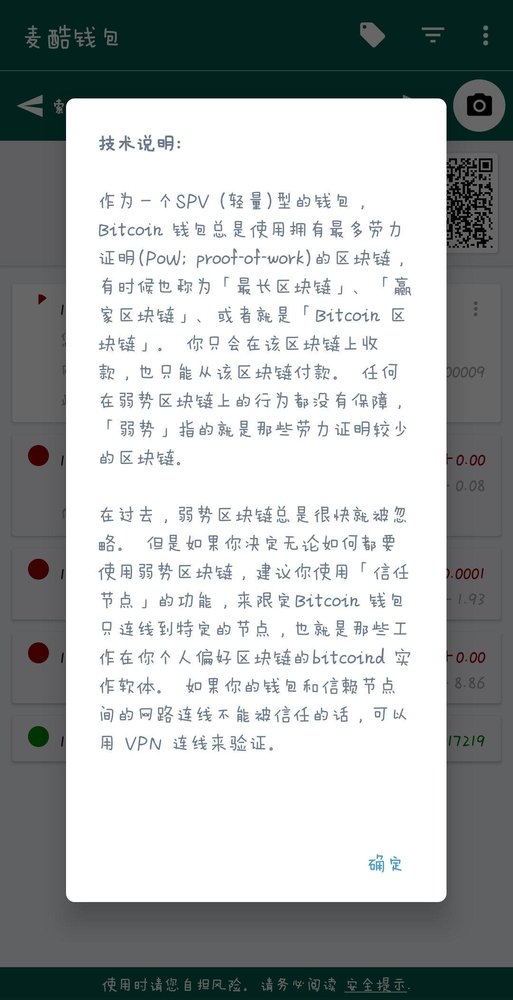

# 麦酷钱包（MyCoolWallet）
[ 测试网络·安装包 apk ](https://github.com/lingyajun/MyCoolWallet/releases/download/v1.0.2/test_net-release-1.0.3.apk)

    
    
    
    

感谢
---
- [Bitcoin Wallet](https://github.com/bitcoin-wallet/bitcoin-wallet), 一个比特币钱包应用程序
- [bitcoinj](https://bitcoinj.github.io) , 一个比特币协议库
- [Bouncy Castle](https://bouncycastle.org)，一个密码学函数库
- [ XUI ](https://github.com/xuexiangjys/XUI), 一个简洁而优雅的Android原生UI框架
- [ZXing](https://github.com/zxing/zxing) ，一个QR码处理库
- [ Material File Picker ](https://github.com/nbsp-team/MaterialFilePicker), 一个文件选取库
- ......
